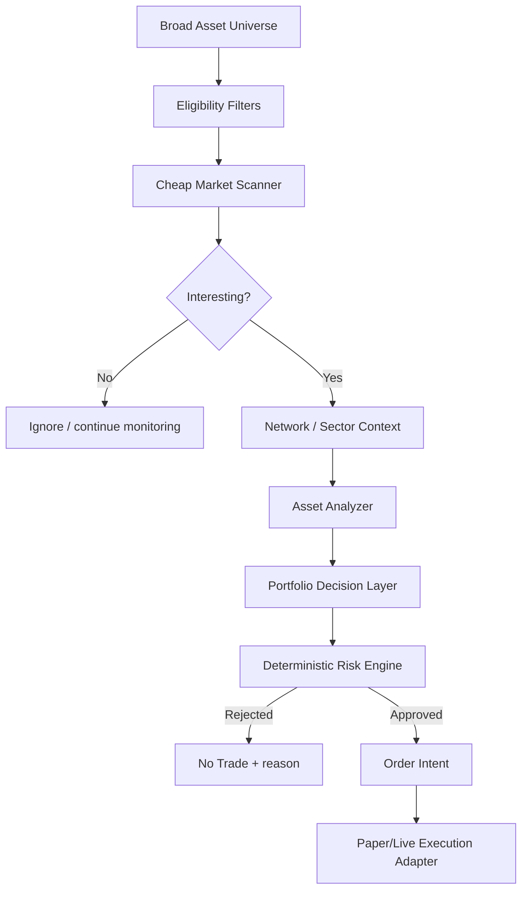
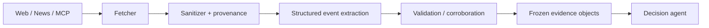
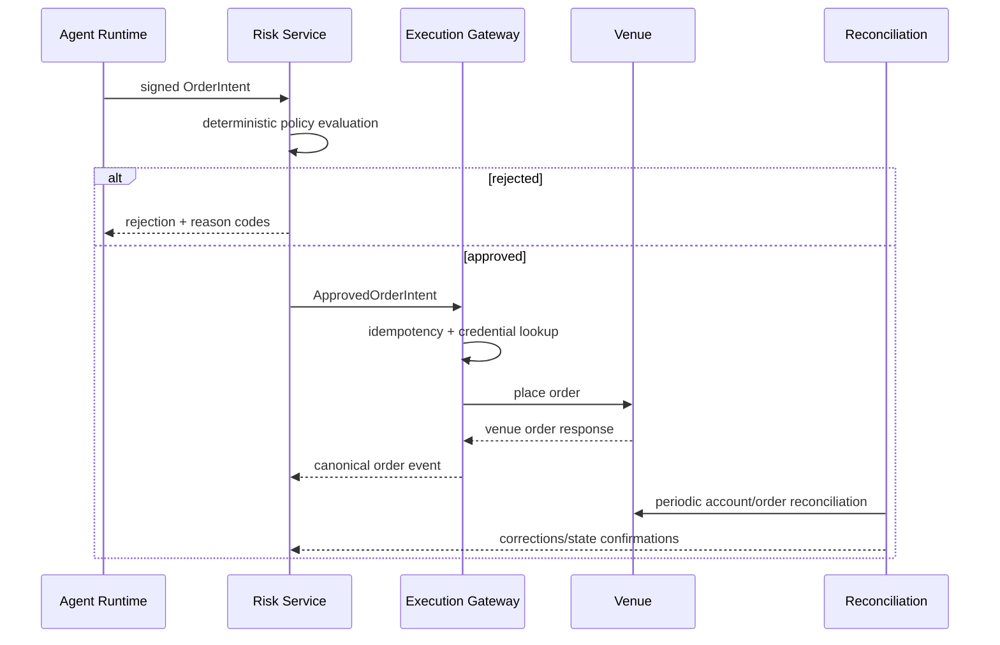

# KAVRIGO — Production Master Specification for a User-Created AI Trading-Agent Platform

**Status:** Architecture / product specification  
**Research date:** 2026-09-04  
**Brand decision:** `Kavrigo` — provisional working/public brand pending registrar acquisition and professional trademark clearance  
**Pronunciation:** `KAV-ri-go`  
**Default launch mode:** historical simulation + paper trading  
**Live execution flag:** `LIVE_TRADING_ENABLED=false` until legal, data-licensing, security, KYC/age, jurisdiction, and operational gates are completed

---

## 0. Executive summary

Build **Kavrigo**, a multi-tenant platform where users create, configure, test, observe, and eventually—where legally permitted—connect AI-assisted crypto trading agents to non-custodial exchange accounts.

The product should **not** be architected as “an LLM with an exchange API key.” It should be an **agentic quantitative-trading operating system**:

1. ingest real-time market, derivatives, on-chain, macro, news, and event data;
2. normalize and timestamp it into point-in-time snapshots;
3. run cheap broad-market scans;
4. activate deeper network/sector/token analysis only when justified;
5. let AI interpret text, conflicting evidence, narrative/context, and uncertainty;
6. use quantitative models for measurable predictive tasks;
7. require every AI decision to produce structured evidence and confidence;
8. submit only an **order intent**, never a raw exchange command;
9. enforce deterministic, versioned risk policy that the LLM cannot override;
10. backtest with realistic cost/latency/fill assumptions;
11. graduate agents through historical → out-of-sample → paper → gated live stages;
12. preserve an immutable audit trail of what data, prompt, model, policy, and code produced every decision.

The strongest product positioning is:

> **Build AI trading agents. Prove their edge. Enforce their risk.**

Do not market the product as guaranteed-profit AI, an infallible financial advisor, or a system that “beats the market.” The defensible moat is **trust, evidence, reproducibility, multi-source intelligence, risk governance, and a strong agent-building UX**.

---

# 1. Product thesis

## 1.1 The problem

Existing crypto-bot platforms are strong at:
- grid/DCA bots;
- rule builders;
- TradingView/webhook automation;
- prebuilt templates;
- basic backtests;
- increasingly, natural-language/AI configuration.

The opportunity is not to recreate another bot-template dashboard. The differentiated product is a platform in which a user can define an **AI research/trading agent** with:
- its own universe;
- data packs;
- decision horizon;
- network/sector context;
- quantitative features;
- news/event interpretation;
- model policy;
- risk policy;
- execution policy;
- performance/evaluation gates;
- inspectable evidence.

Each agent is versioned like software and promoted through environments like software.

## 1.2 Core promise

Every important output should answer:

- **What did the agent know?**
- **When did it know it?**
- **Where did the information come from?**
- **How fresh was the information?**
- **What quantitative evidence supported the idea?**
- **What evidence contradicted it?**
- **What uncertainty remained?**
- **What risk policy applied?**
- **Why did the platform trade, resize, reject, or abstain?**
- **What did the decision cost after fees/slippage/funding?**
- **Can the same decision be reproduced from the recorded snapshot?**

## 1.3 Non-goals for V1

Do not make V1:
- a high-frequency trading platform;
- a leverage/futures-first consumer product;
- a custodial wallet/exchange;
- a token-launch platform;
- a copy-trading marketplace;
- a social-signal casino-like experience;
- a user-code free-for-all;
- a platform promising returns;
- a fully autonomous “financial advisor.”

V1 should be **spot, paper-first, evidence-first, and non-custodial**.

---

# 2. Users and personas

## 2.1 Builder

Wants:
- natural-language agent creation;
- visual controls;
- paper trading;
- clear backtests;
- templates;
- no infrastructure management.

## 2.2 Advanced trader

Wants:
- full control over features and data;
- risk rules;
- multiple exchanges;
- custom decision horizons;
- auditability;
- event-driven triggers.

## 2.3 Quant/research user

Wants:
- point-in-time datasets;
- reproducible experiments;
- walk-forward tests;
- feature attribution;
- API/SDK access;
- exportable results.

## 2.4 Team / professional workspace

Later:
- organizations;
- RBAC;
- SSO/SCIM;
- approval workflows;
- audit export;
- dedicated data licensing;
- model/provider controls;
- dedicated compute.

---

# 3. Product object model

Primary entities:

```text
User
└── Workspace
    ├── Membership / Role
    ├── ExchangeConnection
    ├── DataSubscription / DataPack
    ├── Agent
    │   ├── AgentVersion
    │   ├── PromptVersion
    │   ├── ToolPolicy
    │   ├── RiskPolicyVersion
    │   ├── ExecutionPolicyVersion
    │   ├── BacktestRun
    │   ├── PaperRun
    │   └── LiveRun
    ├── Portfolio
    ├── Decision
    │   ├── EvidenceItem[]
    │   ├── ModelCall[]
    │   ├── MarketSnapshot
    │   └── OrderIntent[]
    ├── Order
    │   └── Fill[]
    ├── Evaluation
    └── BillingUsage
```

Key rule: **runs always reference immutable versions**. Editing an agent creates a new `AgentVersion`; it does not mutate the configuration that produced historical decisions.

---

# 4. Competitive research and positioning

## 4.1 Relevant competitors

### 3Commas
Strong at:
- multi-exchange bot automation;
- templates;
- DCA/grid workflows;
- natural-language AI assistance;
- backtesting;
- mature exchange connections.

### Cryptohopper
Strong at:
- broad exchange support;
- paper trading;
- bot marketplace/templates;
- strategy designer;
- AI-assisted tools.

### Bitsgap
Strong at:
- grid/DCA;
- portfolio tooling;
- demo/backtest experience;
- AI-assisted portfolio features.

### Coinrule
Strong at:
- no-code rules;
- approachable consumer UX;
- cloud automation;
- newer agentic/AI optimization concepts.

### QuantConnect
Not a direct consumer crypto-bot competitor, but strategically important. It demonstrates the value of:
- evidence-gated research;
- realistic backtesting;
- unified research-to-production semantics;
- AI assistance around a serious quant engine.

## 4.2 Differentiation

Build around seven differentiators:

1. **User-created agent specifications**, not just bot parameters.
2. **Evidence ledger** attached to every decision.
3. **Hierarchical intelligence**: global → network/sector → asset → portfolio.
4. **Multi-source data packs** that users can explicitly enable.
5. **Deterministic risk firewall** outside the LLM.
6. **Promotion pipeline**: research → backtest → OOS → paper → live.
7. **Reproducible agent versions** with prompt/model/data/policy hashes.

## 4.3 Positioning statement

> An operating system for building, testing, and governing AI crypto trading agents—using real market, on-chain, derivatives, news, and macro data, with evidence attached to every decision and hard risk controls outside the model.

---

# 5. Product modes

## 5.1 Research mode
- no exchange private credentials;
- historical and delayed/live public data;
- notebooks/reports;
- agent construction;
- feature inspection.

## 5.2 Backtest mode
- frozen point-in-time dataset;
- deterministic seed;
- realistic fill/fee/latency model;
- no external mutable tools during run;
- fully reproducible.

## 5.3 Paper mode
- real live public market data;
- simulated account/orders/fills;
- same risk policies as future live mode;
- safest initial public launch.

## 5.4 Live mode
Only when all gates pass:
- adult/identity/jurisdiction checks as required;
- terms/risk disclosures;
- supported exchange;
- commercial data rights;
- MFA;
- exchange credential restrictions;
- risk limits;
- operational health;
- explicit user activation.

---

# 6. The agent architecture

## 6.1 Core hierarchy

Do **not** run one expensive independent LLM continuously for every token. Use a funnel:



Principle:

> **Collect broadly, analyze selectively, reason per asset/ecosystem, control risk globally.**

## 6.2 Market scanner

Runs cheaply over a broad supported universe.

Possible inputs:
- return/volatility anomalies;
- volume z-score;
- liquidity/spread changes;
- CVD;
- open-interest delta;
- funding z-score;
- liquidation burst;
- DEX volume;
- unusual wallet activity;
- news-event count/importance;
- relative-strength change;
- stablecoin/network flow changes.

Output example:

```json
{
  "asset": "SOL",
  "interest_score": 0.87,
  "reasons": [
    "volume_zscore_gt_3",
    "open_interest_acceleration",
    "news_event_high_novelty"
  ],
  "expires_at": "..."
}
```

It should primarily be deterministic/statistical, not LLM-driven.

## 6.3 Network / ecosystem context

Examples:
- Bitcoin;
- Ethereum;
- Solana;
- L2;
- DeFi;
- RWA;
- AI-token sector;
- other configured narratives.

It publishes shared state such as:

```json
{
  "context_id": "...",
  "scope": "network:solana",
  "health": "normal",
  "liquidity_flow_score": 0.72,
  "activity_score": 0.81,
  "risk_score": 0.31,
  "evidence_refs": ["..."],
  "valid_until": "..."
}
```

This prevents every token analyzer from separately rediscovering the same chain-wide fact.

## 6.4 Asset analyzer

Triggered only for candidates.

Example BTC emphasis:
- spot trend/volatility;
- ETF flows;
- derivatives;
- miners;
- macro;
- exchange balances;
- order flow.

Example SOL emphasis:
- SOL/BTC and SOL/ETH relative strength;
- chain health;
- stablecoin/bridge flows;
- Solana DEX activity;
- SOL derivatives;
- network/ecosystem news.

Example DeFi token emphasis:
- TVL;
- fees/revenue;
- borrowing;
- liquidations;
- governance;
- emissions/unlocks;
- treasury;
- chain conditions.

## 6.5 Portfolio layer

Its job is not “which coins look bullish?” It is:
- correlation;
- concentration;
- network/sector overlap;
- total exposure;
- current positions;
- account cash;
- expected cost;
- risk budget;
- competing opportunities.

Multiple bullish assets may represent one correlated trade.

## 6.6 Risk engine

The risk engine is **not an AI agent**.

It is deterministic code with versioned policy and cannot be modified by the decision model at runtime.

The LLM may propose:
- `BUY`;
- `SELL`;
- `REDUCE`;
- `CLOSE`;
- `HOLD`;
- `NO_TRADE`.

The risk engine decides whether an `OrderIntent` is permitted and at what maximum size.

## 6.7 Abstention

The model must support:
- `BULLISH`;
- `BEARISH`;
- `NEUTRAL`;
- `HIGH_RISK`;
- `UNKNOWN`.

`UNKNOWN` and `NO_TRADE` are first-class successful outcomes.

---

# 7. Data and signals

The platform should model signal families, not dump hundreds of raw indicators into an LLM.

## 7.1 Price / technical
- multi-horizon returns;
- VWAP;
- EMA;
- RSI;
- MACD;
- ATR;
- realized volatility;
- momentum;
- mean-reversion features;
- breakout distance;
- volume profile where licensed.

## 7.2 Order flow / microstructure
- trades;
- bid/ask spread;
- L2 depth;
- depth at ±0.1/0.5/1%;
- order-book imbalance;
- CVD;
- taker buy/sell;
- market-order intensity;
- cross-venue dispersion;
- liquidity regime.

Important: displayed liquidity can be cancelled; combine order-book state with executed trades.

## 7.3 Derivatives
- open interest;
- OI change;
- funding;
- funding z-score;
- long/short positioning;
- liquidations;
- liquidation concentration;
- futures basis;
- options IV;
- realized vs implied volatility;
- skew;
- term structure;
- put/call;
- open interest by strike;
- expiry calendar.

## 7.4 On-chain
- exchange inflow/outflow;
- whale transfers;
- labelled wallets;
- miner activity;
- holder behavior;
- treasury/foundation wallets;
- unexpected mint/burn events;
- chain fees;
- active addresses;
- settlement/network health.

## 7.5 Stablecoins
- stablecoin supply;
- exchange balances;
- issuance/redemption;
- bridge flows;
- DEX pool imbalance;
- peg deviation;
- peg volatility.

## 7.6 ETF / institutional flows
- BTC ETF flows;
- ETH ETF flows;
- 1d/5d aggregates;
- acceleration/deceleration;
- price divergence.

## 7.7 Tokenomics
- token unlocks;
- cliff/linear unlocks;
- unlock % circulating;
- unlock USD / average daily volume;
- emissions;
- staking rewards;
- supply inflation;
- burns;
- buybacks;
- vesting recipients.

## 7.8 DeFi
- TVL;
- fees;
- revenue;
- DEX volume;
- lending utilization;
- liquidation exposure;
- bridge flows;
- liquidity-pool depth;
- LP withdrawal stress.

## 7.9 Network / protocol events
- outages;
- degraded block production;
- congestion;
- validator participation;
- hard forks/upgrades;
- token migrations;
- governance proposals;
- emergency pauses;
- oracle failures;
- contract upgrades.

## 7.10 Exchange / counterparty events
- listing/delisting;
- deposit/withdrawal suspension;
- abnormal venue price divergence;
- unusual exchange-wallet flows;
- public solvency/security events.

## 7.11 Security events
- protocol exploit;
- bridge exploit;
- exchange incident;
- key compromise;
- oracle exploit;
- anomalous mint;
- emergency governance response.

These are primarily **risk events** until confirmed.

## 7.12 News

The AI layer should convert untrusted articles/posts into structured events before the trading agent sees them.

```json
{
  "event_id": "...",
  "assets": ["BTC"],
  "event_type": "regulation",
  "importance": 0.82,
  "sentiment": -0.44,
  "certainty": 0.91,
  "novelty": 0.93,
  "source_quality": 0.95,
  "expected_horizon": "hours",
  "published_at": "...",
  "first_seen_at": "...",
  "primary_source_ref": "...",
  "corroborating_source_refs": []
}
```

The useful dimensions are not merely positive/negative:
- credibility;
- novelty;
- asset relevance;
- severity;
- certainty;
- expected horizon;
- already-priced-in likelihood;
- primary vs secondary source.

## 7.13 Macro
- central-bank decisions;
- CPI/inflation releases;
- employment;
- rates;
- Treasury yields;
- DXY;
- equity risk sentiment;
- VIX;
- liquidity conditions;
- major scheduled releases.

Agents should know when scheduled high-impact events are near. This can trigger reduced risk or abstention.

## 7.14 Regulation / legal events
- exchange enforcement;
- ETF policy;
- stablecoin law;
- custody rules;
- tax changes;
- token classification;
- sanctions;
- banking access.

Primary documents should outrank commentary.

## 7.15 Geopolitical events
Classify:
- severity;
- countries/markets affected;
- energy/USD/risk implications;
- crypto-specific impact;
- confidence.

The system reacts to evidence; it does not pretend to predict geopolitics reliably.

## 7.16 Social/narrative attention
- mention velocity;
- unique authors;
- engagement velocity;
- search-interest change;
- sentiment change;
- bot/spam probability;
- narrative/sector rotation.

Never use raw “social bullish %” as an isolated trade trigger.

## 7.17 Relative strength
Track:
- asset/USD;
- asset/BTC;
- asset/ETH;
- asset/sector;
- sector/BTC.

This distinguishes nominal gains from genuine outperformance.

---

# 8. Data-provider architecture and decisions

## 8.1 Critical principle: MCP is not the tick bus

Use:

```text
Exchange WebSocket / provider stream
        ↓
normalizer
        ↓
event stream
        ↓
feature engine / storage
        ↓
frozen snapshot
        ↓
agent
```

MCP is excellent for:
- exploratory analysis;
- agent research;
- contextual queries;
- tool-enabled report generation.

MCP is generally not the right primary path for:
- per-tick ingestion;
- high-throughput backend services;
- latency-sensitive execution.

CoinGlass explicitly recommends REST for backend/high-performance production use and currently labels its MCP beta.

## 8.2 V1 provider choices

### Direct exchange public WebSockets
Use for:
- trades;
- ticker;
- order book;
- candles where useful.

Prefer native venue WS for launch venues.

### CoinGlass REST + MCP
Use REST for production derivatives ingestion:
- funding;
- OI;
- liquidations;
- sentiment/positioning;
- ETF-related derivatives analytics where covered.

Use MCP for agent research and internal analyst tooling.

### CoinGecko commercial API
Use for:
- broad reference universe;
- metadata;
- prices/market cap/reference metrics;
- discovery.

Do not redistribute raw API access unless your license allows it.

### Dune API + MCP
Use for:
- custom on-chain queries;
- network/protocol activity;
- decoded smart-contract data;
- research across many chains.

### Later / optional
- CryptoQuant for specialized exchange-flow/on-chain metrics;
- Messari for token-unlock/vesting datasets;
- DefiLlama for DeFi/TVL/stablecoins/bridges;
- Glassnode for standardized on-chain metrics;
- Kaiko or CoinAPI for licensed normalized enterprise multi-venue market data.

## 8.3 Data licensing is a launch blocker

Before public display:
- get written confirmation of commercial display rights;
- distinguish “display” from “redistribution”;
- do not proxy/resell raw provider APIs;
- store/retain raw data only as allowed;
- obey attribution;
- document permitted derived-data use;
- enforce tenant/plan entitlements for paid data packs.

A public-facing trading platform is a materially different use case from personal API consumption.

## 8.4 Data provenance

Every derived feature must preserve:
- provider;
- source instrument;
- exchange;
- event time;
- ingest time;
- sequence number if available;
- schema version;
- correction/revision flag;
- transform version.

## 8.5 Point-in-time correctness

Some on-chain providers can revise historical labels/clustering after new information becomes available.

For credible backtests:
- record what the platform actually knew at the time;
- snapshot provider responses where license allows;
- distinguish `event_time`, `provider_revision_time`, and `ingested_at`;
- never silently replay today’s improved labels into an old backtest and call it historical reality.

---

# 9. Agent specification / DSL

V1 should **not** run arbitrary user Python inside core services.

Users build agents through:
- natural language;
- structured controls;
- templates;
- an inspectable declarative spec.

Natural language compiles into an `AgentSpec`. The user can review it before activating.

Example:

```yaml
apiVersion: agents.platform/v1
kind: TradingAgent
metadata:
  name: btc-eth-balanced-research
spec:
  mode: paper
  universe:
    assets: [BTC-USD, ETH-USD]
    marketType: spot
  schedule:
    decisionInterval: 15m
    eventTriggers:
      - news.high_importance
      - derivatives.liquidation_burst
  dataPacks:
    - market_microstructure
    - derivatives
    - news
    - macro
    - onchain_core
  analysis:
    hierarchy:
      marketScanner: true
      networkContext: true
      assetAnalyzer: true
      portfolioLayer: true
    horizons: [15m, 1h, 4h]
    allowAbstain: true
  modelPolicy:
    profile: balanced
    maxCostPerDecisionUsd: 0.10
    maxToolCalls: 12
  riskPolicyRef: rp_v17
  executionPolicyRef: ep_v4
  evidence:
    minSourceQuality: 0.65
    requireTimestamps: true
    requireContradictingEvidence: true
```

## 9.1 No-code first, sandboxed code later

Later “Code Strategy” tier:
- execute user code only inside strongly isolated sandboxes;
- no production credentials inside sandbox;
- outbound network allowlist;
- strict CPU/RAM/time quotas;
- read-only point-in-time datasets;
- signed output artifacts;
- deterministic dependency lockfiles.

A managed sandbox platform such as E2B/Daytona can be evaluated for this later. Do not make arbitrary code execution part of the first live-trading launch.

---

# 10. Decision contract

An agent does not call an exchange write tool.

It returns a structured decision:

```json
{
  "decision_id": "dec_...",
  "agent_version_id": "av_...",
  "snapshot_id": "snap_...",
  "symbol": "BTC-USD",
  "horizon_minutes": 60,
  "market_regime": "uptrend_high_leverage",
  "state": "HIGH_RISK",
  "signals": {
    "price": 0.61,
    "order_flow": 0.72,
    "derivatives": -0.38,
    "liquidity": -0.15,
    "onchain": 0.30,
    "tokenomics": 0.00,
    "defi": 0.08,
    "events": 0.12,
    "news": -0.20,
    "macro": -0.42
  },
  "prediction": {
    "expected_return_bps": 18,
    "confidence": 0.61,
    "uncertainty": 0.37
  },
  "proposed_action": "NO_TRADE",
  "proposed_notional_usd": 0,
  "evidence_refs": ["ev_1", "ev_2"],
  "contradicting_evidence_refs": ["ev_3"],
  "risk_flags": ["crowded_long_market"],
  "reason_codes": [
    "positive_momentum",
    "oi_acceleration",
    "funding_extreme",
    "edge_below_required_margin"
  ]
}
```

Do not depend on unconstrained prose for execution.

---

# 11. Deterministic risk system

## 11.1 Hard invariants

Examples:
- stale data → reject;
- unknown exchange/account state → reject;
- unsupported symbol → reject;
- estimated edge <= estimated cost + safety margin → reject;
- max position exceeded → resize/reject;
- portfolio concentration exceeded → reject;
- network/sector concentration exceeded → reject;
- daily loss limit reached → suspend new risk;
- drawdown circuit breaker reached → suspend;
- spread/depth unacceptable → reject;
- high-impact scheduled event policy triggered → reject/reduce;
- reconciliation stale → reject;
- exchange connectivity degraded → reject;
- credential status uncertain → reject;
- agent version not approved for current environment → reject.

## 11.2 Risk hierarchy

```text
Global platform limits
    ↓
Workspace/account limits
    ↓
Portfolio limits
    ↓
Network/sector limits
    ↓
Agent limits
    ↓
Asset limits
    ↓
Order limits
```

The most restrictive applicable rule wins.

## 11.3 Risk policy example

```yaml
maxGrossExposurePct: 50
maxSingleAssetExposurePct: 15
maxNetworkExposurePct: 25
maxOpenPositions: 6
maxDailyLossPct: 2
maxDrawdownPct: 8
minLiquidityUsd: 5000000
maxSpreadBps: 20
maxDataAgeMs:
  trades: 5000
  book: 2000
  derivatives: 120000
  news: 900000
eventRisk:
  blockNewPositionsBeforeMacroMinutes: 10
```

Numbers above are examples for configuration design, not universal investment recommendations.

## 11.4 Kill switches

Required:
- global kill;
- workspace kill;
- exchange connection kill;
- agent kill;
- asset kill;
- risk-class kill.

A kill switch should stop **new order submission**, then safely reconcile open orders/positions according to configured policy.

---

# 12. Backtesting and evaluation

## 12.1 Engine choice

Use a stable production release of **NautilusTrader** behind our own adapter/contracts.

Why:
- Rust-native core;
- deterministic event-driven architecture;
- realistic order/fill/latency/fee models;
- backtest/live semantic parity;
- Python strategy/control interface;
- avoids years of rebuilding market simulation infrastructure.

Important:
- pin a stable version;
- do not use nightly/RC features in production without explicit ADR;
- review LGPLv3 obligations with counsel;
- keep our domain contracts independent so the engine can be replaced if needed.

## 12.2 Backtest requirements

Every run records:
- dataset snapshot/hash;
- provider/license context;
- agent version;
- prompt version;
- model/version policy;
- feature-transform version;
- risk policy;
- execution model;
- fee schedule;
- slippage model;
- latency model;
- random seed where stochastic;
- code/container image digest.

## 12.3 Prevent look-ahead bias
- event-time ordering;
- point-in-time news timestamps;
- point-in-time on-chain labels where possible;
- no “latest” provider state inside historical runs;
- no future candles;
- no future token-listing/unlock knowledge before publication;
- use purged/embargoed splits where overlapping labels make ordinary CV invalid.

## 12.4 Reality modeling
Include:
- maker/taker fees;
- spread;
- partial fills;
- queue/fill assumptions;
- slippage;
- latency;
- funding if derivatives are ever added later;
- minimum size/tick;
- order rejection;
- rate limits;
- downtime/data gaps.

## 12.5 Evaluation
Do not approve based on raw P&L.

Track:
- net return after cost;
- benchmark-relative performance;
- maximum drawdown;
- volatility;
- Sharpe/Sortino as supporting metrics;
- downside/expected-shortfall metrics;
- turnover;
- average trade;
- profit factor;
- win/loss distribution;
- exposure;
- performance by market regime;
- performance by asset;
- performance by signal family;
- performance by time/session;
- sensitivity to cost assumptions.

## 12.6 Promotion gates

```text
Draft
  ↓
Historical Backtest
  ↓
Out-of-sample / Walk-forward
  ↓
Paper Candidate
  ↓
Paper Observation
  ↓
Live Eligible (policy/legal/security gate)
  ↓
Live Limited
  ↓
Live Expanded
```

A failed gate returns to a new version; do not rewrite history.

---

# 13. AI architecture

## 13.1 Responsibilities for LLMs

Good uses:
- news/event extraction;
- source comparison;
- identifying contradictions;
- summarizing governance/protocol documents;
- mapping narrative to affected assets/networks;
- explaining multi-signal context;
- deciding whether evidence is sufficient;
- producing a structured recommendation;
- user-facing explanation.

Bad uses:
- raw tick processing;
- arithmetic that can be deterministic;
- fee computation;
- position sizing invariants;
- credential handling;
- direct exchange commands;
- deciding whether risk limits may be ignored.

## 13.2 Agent orchestration choice

### Decision: Temporal for durable business workflows

Use **Temporal Cloud** for:
- long-running agent runs;
- retries;
- backtest orchestration;
- reconciliation workflows;
- scheduled evaluation;
- stateful promotion;
- recoverable asynchronous jobs.

Do **not** feed every market tick through Temporal. Redpanda handles streams; Temporal handles durable workflows.

### AI tool-calling layer: OpenAI Agents SDK

Use the OpenAI Agents SDK initially for:
- tool orchestration;
- structured agent behavior;
- sandboxed/controlled tasks where appropriate.

But create an internal provider abstraction:

```python
class ModelGateway(Protocol):
    async def structured(self, request: ModelRequest) -> ModelResponse: ...
    async def embed(self, request: EmbeddingRequest) -> EmbeddingResponse: ...
```

The domain must not depend directly on one model vendor.

### Gateway: Portkey (or equivalent internal gateway)

Use a model gateway for:
- multi-provider routing;
- retries;
- budgets;
- rate limits;
- fallback;
- trace metadata;
- guardrails;
- per-workspace spend policy.

Do not let a provider fallback silently change a model in a reproducible backtest. Backtests must pin a model/version or recorded response artifact.

## 13.3 Why not LangGraph as the primary orchestrator?

LangGraph is strong for stateful agent graphs, but Temporal already owns durable process state/retries. Using both as co-equal orchestration layers in V1 creates overlapping semantics and operational complexity.

Use:
- Temporal = outer durable workflow;
- Agents SDK = inner AI/tool execution.

Revisit LangGraph only if a concrete AI graph becomes materially easier to maintain with it.

## 13.4 AI observability

Use **Langfuse** for:
- LLM traces;
- prompt versions;
- token/cost metrics;
- model latency;
- evaluation datasets;
- online/offline evals.

But the official **trade audit ledger** remains our own immutable record. Langfuse is not the compliance/source-of-truth ledger.

## 13.5 Model routing profiles

Avoid hard-coding product behavior to current model names.

Create profiles:
- `extract_fast`: cheap structured event extraction;
- `classify_fast`: relevance/sentiment/novelty;
- `reason_balanced`: ordinary deep asset analysis;
- `reason_deep`: rare high-impact analysis;
- `embed`: deduplication/search.

Per profile configure:
- allowed providers/models;
- max tokens;
- max calls;
- timeout;
- fallback;
- cost cap;
- data-retention policy.

---

# 14. Prompt-injection and tool safety

Internet/news/MCP data is **untrusted content**, never system instruction.

Pipeline:



Rules:
- decision agents do not consume arbitrary HTML;
- no raw webpage can grant permissions;
- all tools have typed schemas;
- tools are explicitly allowlisted;
- production agent tools are read-only;
- exchange write capability is not exposed to LLM runtime;
- URLs/domains are provenance, not instructions;
- suspicious instructions inside content are logged and ignored;
- model outputs are schema-validated;
- external text cannot change system/tool/risk policy.

Threat model against:
- prompt injection;
- tool poisoning;
- MCP server compromise;
- malicious news content;
- stale/mislabelled provider data;
- sensitive-data disclosure;
- excessive agency.

Use OWASP LLM guidance and NIST AI RMF/GenAI guidance as baselines.

---

# 15. Execution architecture

## 15.1 Non-custodial design

The platform should not hold user crypto in V1.

User connects an exchange account where permitted.

Credential policy:
- trade/read scope only;
- withdrawals disabled;
- no seed phrases/private wallet keys;
- least privilege;
- IP restrictions if venue supports them;
- separate sub-account recommended where available.

## 15.2 Secret isolation

Plaintext exchange credentials must never be visible to:
- browser;
- LLM;
- news agent;
- model gateway;
- general application logs;
- analytics warehouse.

Use:
- AWS KMS envelope encryption;
- Secrets Manager;
- a dedicated `execution-credential-service`;
- IAM role that only the isolated execution deployment can assume;
- per-environment/per-tenant cryptographic context.

## 15.3 Order flow



## 15.4 Exactly-once reality

Do not claim magical exactly-once trading.

Use:
- at-least-once messages;
- idempotent command handlers;
- deterministic client order IDs;
- dedupe keys;
- order state machine;
- exchange reconciliation;
- fencing/leader lease so only one executor can write for an account.

## 15.5 Split-brain protection

For each `exchange_connection_id`, only one live execution lease may be active.

Use a fencing token:
- increment on lease acquisition;
- include with internal order command;
- execution gateway rejects stale fencing tokens.

## 15.6 Venue adapters

Launch:
- 1–2 spot exchanges with mature APIs and legal availability in target markets;
- use native adapters for execution-critical semantics;
- CCXT may be used as a compatibility/reference layer, not as the sole mission-critical abstraction.

Add exchanges only when:
- order state mapping tested;
- reconnect/replay tested;
- rate-limit model tested;
- error mapping tested;
- reconciliation tested;
- credential controls confirmed.

---

# 16. Technology stack — final decisions

## 16.1 Frontend

**Choose**
- Next.js **16.3.3+ Active LTS** (apply current security patches);
- React 19.2;
- TypeScript strict;
- Tailwind CSS 4.3+;
- shadcn/ui with **Base UI** for new components;
- TanStack Query;
- TanStack Table;
- TradingView Lightweight Charts;
- Zod for client validation;
- generated OpenAPI client.

Why:
- mature ecosystem;
- current Next.js is explicitly agent-ready;
- shadcn’s current default is Base UI;
- excellent control over dense terminal-like UX;
- AI coding agents understand this stack well.

## 16.2 Backend language

**Choose Python for the application/quant backend**, rather than splitting V1 across Node + Python + Go.

Use:
- Python 3.13/current supported;
- FastAPI;
- Pydantic v2;
- uv for dependency/workspace management;
- asyncio;
- orjson;
- Polars;
- PyArrow;
- NumPy;
- scikit-learn / LightGBM/XGBoost where justified.

Why:
- one backend language for AI + quant + APIs;
- Pydantic contracts;
- strongest research ecosystem;
- performance-sensitive dataframe work is delegated to Rust/Arrow-based libraries;
- NautilusTrader provides Rust-native hot-path trading infrastructure.

Add Rust/Go only after profiling proves a bottleneck.

## 16.3 Trading/backtest engine

**Choose NautilusTrader stable** behind internal interfaces.

## 16.4 API style

**Choose REST/OpenAPI** for control plane.

Use:
- SSE for agent run logs/progress;
- WebSocket for live high-frequency UI market updates;
- Protobuf for stream/internal event contracts.

Do not add GraphQL in V1.

## 16.5 Streaming

**Choose Redpanda**.

Development / early:
- Serverless is acceptable.

Production:
- Dedicated or BYOC multi-AZ;
- BYOC is preferred when security/data-residency requirements justify it.

Why:
- Kafka protocol compatibility;
- high throughput;
- simpler operational model;
- schema-registry/event ecosystem;
- BYOC keeps data in our cloud environment.

## 16.6 OLTP

**Choose Amazon Aurora PostgreSQL 18.x**, managed.

Use it for:
- users/workspaces;
- agent specs/versions;
- risk/execution policy;
- exchange connection metadata;
- billing state;
- current order/position projections;
- approvals;
- entitlements;
- audit indexes.

Use PostgreSQL RLS as defense-in-depth for tenant-scoped application tables.

## 16.7 Analytics/time-series

**Choose ClickHouse Cloud**, not TimescaleDB, as the main analytical store.

Use it for:
- market events;
- feature history;
- decision analytics;
- backtest metrics;
- P&L/risk time series;
- market-data exploration.

Why:
- better fit for huge append-heavy time-series/event workloads;
- fast multi-dimensional analytics;
- lower need to overload the OLTP database.

## 16.8 Object store

**Amazon S3**:
- raw permitted market packets;
- Parquet datasets;
- backtest artifacts;
- model/eval artifacts;
- immutable audit exports;
- SBOM/report artifacts.

Use object lock/WORM where required for audit archives.

## 16.9 Cache

**Amazon ElastiCache for Valkey**:
- cache;
- ephemeral coordination;
- rate limiting;
- UI sessions if needed.

Never use it as the authoritative order/position store.

## 16.10 Workflow engine

**Temporal Cloud**.

## 16.11 Application compute

**AWS EKS Auto Mode**.

Why over ECS/serverless:
- long-running market streams;
- workers;
- predictable service networking;
- varied compute;
- Kubernetes ecosystem;
- managed compute/network/storage reduces ordinary EKS operations.

Keep stateful managed databases outside the cluster.

## 16.12 Edge

**Cloudflare** in front:
- CDN;
- WAF;
- bot protection;
- Turnstile for abuse-sensitive flows;
- rate controls.

Origin remains AWS.

## 16.13 Infrastructure as code

**Choose OpenTofu** over Terraform/Pulumi for V1 infrastructure.

Why:
- declarative HCL model;
- broad Terraform-provider compatibility;
- open governance;
- low application-language coupling;
- easier infra review by specialists.

Use:
- reusable modules;
- remote encrypted state;
- separate state per environment;
- plan review in PR;
- no developer local apply to production.

## 16.14 GitOps

- GitHub Actions: test/build/scan/sign/push.
- Argo CD: pull-based deployment to EKS.
- ECR: container registry.
- GitHub OIDC to AWS: no long-lived CI cloud keys.

---

# 17. Repository strategy

Use a **hybrid repo model**, not dozens of microservice repos and not one security-blind monolith.

## Repo 1 — `kavrigo-platform`

Product/control-plane monorepo.

```text
kavrigo-platform/
├── apps/
│   └── web/                    # Next.js
├── services/
│   └── api/                    # FastAPI control plane
├── packages/
│   ├── ui/
│   ├── api-client/
│   ├── contracts-generated/
│   └── config/
├── docs/
│   ├── adr/
│   ├── product/
│   ├── api/
│   └── threat-model/
├── AGENTS.md
└── MASTER_BUILD_SPEC.md
```

## Repo 2 — `kavrigo-engine`

Quant/data/agent services.

```text
kavrigo-engine/
├── services/
│   ├── market-ingestion/
│   ├── feature-engine/
│   ├── news-intelligence/
│   ├── agent-runtime/
│   ├── portfolio-engine/
│   ├── risk-engine/
│   ├── backtest-service/
│   ├── paper-broker/
│   └── reconciliation/
├── libs/
│   ├── domain/
│   ├── data-contracts/
│   ├── signals/
│   ├── model-gateway/
│   ├── provider-adapters/
│   └── nautilus-adapter/
├── tests/
│   ├── unit/
│   ├── integration/
│   ├── property/
│   ├── replay/
│   └── evals/
└── AGENTS.md
```

## Repo 3 — `kavrigo-execution-security`

Highly restricted private repo and deployment boundary.

```text
kavrigo-execution-security/
├── execution-gateway/
├── credential-service/
├── venue-adapters/
├── reconciliation/
├── signing/
├── security-tests/
├── threat-model/
└── CODEOWNERS
```

Access limited to a small set of maintainers. AI coding tools must not receive production secrets.

## Repo 4 — `kavrigo-infra`

```text
kavrigo-infra/
├── tofu/
│   ├── modules/
│   └── envs/
├── kubernetes/
│   ├── base/
│   └── overlays/
├── argocd/
├── policies/
├── observability/
└── runbooks/
```

## Repo 5 — `kavrigo-research`

```text
kavrigo-research/
├── notebooks/
├── experiments/
├── feature-studies/
├── datasets/
├── evals/
├── leakage-audits/
└── reports/
```

No production credentials.

## Why not a repo per microservice?

Too much:
- CI duplication;
- contract drift;
- dependency fragmentation;
- operational overhead.

Split only at real security/team/lifecycle boundaries.

---

# 18. Event architecture

## 18.1 Canonical envelope

Use Protobuf + Schema Registry.

Every event:

```text
event_id
event_type
schema_version
tenant_scope (if private)
source
event_time
ingested_at
sequence
trace_id
correlation_id
payload
```

## 18.2 Suggested topics

```text
market.trade.raw.v1
market.book.raw.v1
market.candle.v1
market.reference.v1

derivatives.funding.v1
derivatives.oi.v1
derivatives.liquidation.v1

onchain.flow.v1
onchain.network_health.v1
defi.metrics.v1
tokenomics.event.v1

news.article.raw.v1
news.event.normalized.v1
macro.event.v1
security.event.v1

feature.asset.v1
feature.network.v1
feature.market.v1

agent.trigger.v1
agent.decision.v1
risk.evaluation.v1
order.intent.v1
order.state.v1
fill.v1
portfolio.snapshot.v1

audit.event.v1
billing.usage.v1
```

## 18.3 Partitioning

Examples:
- public market events: `venue + symbol`;
- network data: `chain`;
- decisions: `workspace_id + agent_id`;
- account orders: `exchange_connection_id`.

Ordering guarantee should be scoped to the partition key, not globally.

---

# 19. Temporal workflows

Examples:

## `AgentEvaluationWorkflow`
1. validate agent/environment;
2. request frozen market/evidence snapshot;
3. compute/resolve features;
4. call agent runtime;
5. validate decision schema;
6. run portfolio/risk;
7. record decision;
8. submit paper/live intent if approved;
9. record evaluation metrics.

## `BacktestWorkflow`
1. resolve immutable agent version;
2. resolve dataset snapshot;
3. shard run;
4. execute;
5. aggregate;
6. evaluate;
7. store reproducibility bundle.

## `ExchangeReconciliationWorkflow`
- poll venue state;
- compare orders/fills/balances;
- reconcile canonical state;
- raise incidents;
- suspend execution on unacceptable divergence.

## `DataHealthWorkflow`
- provider health;
- stale streams;
- sequence gaps;
- clock drift;
- cross-provider divergence.

---

# 20. Multi-tenancy

Tenant boundary = `workspace_id`.

Rules:
- all control-plane tables tenant-scoped where appropriate;
- PostgreSQL RLS defense-in-depth;
- every service request carries a verified workspace context;
- analytics queries include tenant constraints;
- object-store prefixes + IAM conditions;
- API rate limits per workspace;
- model budget per workspace;
- exchange secret cryptographic context includes workspace/account identifiers.

Do not depend only on frontend filters.

---

# 21. Authentication and identity

## Decision: Clerk for product authentication

Use:
- passkeys;
- MFA;
- organizations/workspaces;
- session management.

Require MFA before:
- adding/editing exchange credentials;
- enabling live execution;
- changing withdrawal-related checks;
- modifying high-impact risk settings;
- creating privileged API keys.

For professional enterprise needs, reevaluate Auth0/WorkOS when SAML/SCIM/contracts justify it.

---

# 22. KYC, age, jurisdiction, and live-trading gate

Research/paper mode can be separated from live execution.

Before live mode in any jurisdiction:
- get qualified legal advice;
- determine licensing/registration requirements;
- implement age/identity verification where required;
- implement country/jurisdiction eligibility;
- implement sanctions/AML controls where applicable;
- use adult-only live execution if required by venue/jurisdiction;
- do not help users bypass exchange/platform KYC or age restrictions.

## Suggested vendor direction

**Sumsub** is a strong all-in-one candidate for:
- identity/KYC;
- age verification;
- AML screening;
- transaction/crypto monitoring modules;
- broader compliance workflows.

Chainalysis/TRM can be considered later for deeper on-chain risk if the product handles workflows that justify it.

---

# 23. Regulatory architecture principles

This is not legal advice; obtain counsel before live launch.

## EU / MiCA

MiCA defines crypto-asset services that include concepts such as:
- execution of orders on behalf of clients;
- advice;
- portfolio management.

Advice/portfolio management can carry suitability obligations.

Therefore:
- do not assume “non-custodial” automatically means “unregulated”;
- preserve complete decision/execution records;
- keep product modes separable;
- make live execution jurisdiction-gated;
- make “advice-like” experiences legally reviewable;
- retain risk/suitability information only as permitted and needed.

## US / other markets

Software by itself is not automatically the same thing as money transmission, but classification depends on what the product actually does.

Do not design around regulatory avoidance. Design modularly so:
- research;
- paper;
- live execution;
- custody;
- derivatives

are separately gated capabilities.

## Launch recommendation

Public V1:
- research + paper;
- spot;
- non-custodial;
- no performance fees;
- strong risk disclosures;
- no guaranteed-profit claims.

Live execution is a later regulated feature flag.

---

# 24. Security architecture

## 24.1 Security principles
- least privilege;
- deny by default;
- zero trust between services;
- strong tenant isolation;
- secrets never in model context;
- no plaintext exchange key in normal app DB;
- immutable audit;
- fail closed for stale/unknown state.

## 24.2 Service-to-service
- AWS Pod Identity/IAM;
- TLS everywhere;
- mTLS/service identity where appropriate;
- network policies;
- private subnets;
- no public databases.

## 24.3 Secret storage
- KMS + Secrets Manager;
- envelope encryption;
- dedicated execution role;
- key rotation procedure;
- audit decrypt calls;
- emergency revocation.

## 24.4 Supply chain
- GitHub branch protection;
- CODEOWNERS;
- CodeQL;
- secret scanning;
- Dependabot/Renovate;
- Semgrep;
- Trivy;
- SBOM with Syft;
- image signing with Cosign;
- provenance/attestation;
- pinned base images and lockfiles.

## 24.5 Production access
- SSO/MFA;
- JIT/break-glass access;
- no shared credentials;
- audit all privileged actions;
- short-lived credentials;
- read-only by default.

## 24.6 High-impact code review
Changes to:
- risk engine;
- execution;
- credential service;
- auth;
- billing entitlements;
- tenant isolation;
- schema migrations

require stricter CODEOWNERS and review gates.

---

# 25. Audit ledger

Every decision should be reconstructable.

Record:

```text
decision_id
workspace_id
agent_id
agent_version_id
prompt_hash
model_profile
resolved_model_identifier
model_call_id
tool_policy_version
risk_policy_version
execution_policy_version
snapshot_id
dataset/source versions
evidence ids
tool result hashes
feature vector hash
decision output
risk result
order intent id
order/fill ids
trace id
container image digest
created_at
```

Use append-only audit events plus normal query projections.

Do **not** event-source every part of the application merely because trading is event-driven.

---

# 26. Observability / SRE

## 26.1 Stack
- OpenTelemetry everywhere;
- Grafana Cloud or managed Prometheus/Loki/Tempo stack;
- Langfuse for LLM-specific tracing/evals;
- ClickHouse for business/trading analytics;
- PagerDuty/Opsgenie-equivalent incident routing;
- structured JSON logs.

## 26.2 Critical metrics

### Data
- provider latency;
- stale symbols;
- sequence gaps;
- WS reconnects;
- event lag;
- cross-venue price divergence.

### Agent
- run success;
- time per stage;
- tool-call count;
- token/cost;
- schema failure;
- abstention rate;
- prompt-injection detections.

### Risk/execution
- risk rejection rate;
- order submit latency;
- venue reject rate;
- reconciliation mismatch;
- open-order age;
- duplicate-command prevention;
- execution lease status.

### Platform
- API p95/p99;
- DB pool saturation;
- stream consumer lag;
- Temporal workflow failures;
- queue depth;
- tenant quota consumption.

## 26.3 SLO examples

Define explicit SLOs before live mode:
- control API availability;
- data freshness;
- reconciliation freshness;
- order intent processing;
- audit durability;
- secret-service availability.

Do not invent ultra-low latency if the product is not HFT.

---

# 27. Frontend information architecture

## Public
- Landing;
- How it works;
- Data / integrations;
- Security;
- Pricing;
- Research/education;
- Status;
- Legal/risk disclosures;
- Login.

## Product
- Overview;
- Agent Studio;
- Agents;
- Backtest Lab;
- Paper/Live Runs;
- Portfolio;
- Decisions / Evidence;
- Market Intelligence;
- Exchanges;
- Data Packs;
- Risk Center;
- Usage/Billing;
- Settings.

## Admin/compliance
- tenant support;
- provider health;
- exchange incident controls;
- risk kill switches;
- jurisdiction flags;
- KYC review state;
- audit export;
- data-license entitlements.

---

# 28. Agent Studio UX

Primary creation flow:

```text
1. Describe agent
2. Choose universe
3. Choose data packs
4. Choose horizon/triggers
5. Review generated AgentSpec
6. Configure risk
7. Backtest
8. Inspect evidence/results
9. Launch paper run
10. Promote only if eligible
```

## Two-pane editor

Left:
- natural-language assistant.

Right:
- canonical structured configuration.

The assistant can propose changes, but the right pane is the authoritative spec.

## Agent graph view

Visualize:

```text
Scanner
  ↓
Network Context
  ↓
Asset Analysis
  ↓
Portfolio
  ↓
Risk
  ↓
Paper Execution
```

Users should understand which component owns each decision.

---

# 29. Decision / evidence UX

Every decision page should show:

1. action / no-action;
2. confidence and uncertainty;
3. timestamp;
4. data freshness;
5. market regime;
6. signal-family scores;
7. supporting evidence;
8. contradicting evidence;
9. model reasoning summary;
10. risk evaluation;
11. estimated costs;
12. resulting paper/live order;
13. later outcome.

Do not expose hidden chain-of-thought. Show concise, structured **decision rationale and evidence**, not private model scratchpad.

---

# 30. Brand identity, naming decision, and visual system

## 30.1 Final working brand decision

Use **Kavrigo** as the provisional product/company brand while legal clearance is completed.

- Display name: `Kavrigo`
- Wordmark: `KAVRIGO`
- Pronunciation: **KAV-ri-go**
- Category descriptor: **AI trading-agent operating system**
- Compact tagline: **Build agents. Prove the edge.**
- Full positioning line: **Build agents. Prove the edge. Enforce the risk.**
- Hero statement: **Build AI trading agents you can test, inspect, and govern.**
- Primary CTA: **Start in paper mode**
- Secondary CTA: **Explore how it works**

`Kavrigo` is intentionally an abstract/coined brand rather than a descriptive combination containing `Trade`, `Quant`, `Alpha`, `Crypto`, `Bot`, or `AI`. The brand should be able to expand later into other asset classes, institutional agent infrastructure, research, or execution tooling without requiring a rename.

Do **not** invent a fake etymology for the name. The brand story is simply that Kavrigo was selected for distinctiveness, memorability, category flexibility, and lower observed collision than literal trading names.

### Brand thesis

Kavrigo should feel like infrastructure for serious market intelligence, not a consumer gambling product and not a “magic AI trader.” The emotional territory is:

- control;
- evidence;
- rigor;
- transparency;
- intelligence;
- measured autonomy;
- safety boundaries;
- professional market tooling.

The brand should make a sophisticated user think **“I can build and verify a system here”**, not **“this app will make me rich.”**

## 30.2 Naming research and rejected directions

A preliminary web/common-law collision screen was performed on 2026-09-04. It is not legal trademark clearance.

| Candidate | Decision | Reason |
|---|---|---|
| **Kavrigo** | **SELECT — provisional** | Lowest observed relevant collision in the screened pool; abstract, extensible, pronounceable. Searches surfaced surname/username uses, but no obvious indexed trading/AI-software company using the exact name. Registrar and trademark counsel checks are still mandatory. |
| TradeForge | Reject | Existing investing/financial-markets use; too direct a category collision. |
| AgentAlpha | Reject | Existing AI/finance use. |
| SignalForge | Reject | Existing trading/backtesting use. |
| AlphaOS | Reject | Existing financial-research use. |
| QuantForge | Reject | Existing trading/quant software/framework use. |
| CryptoPilot | Reject | Existing crypto analysis/trading use and category-limiting name. |
| Tradara | Reject | Direct AI/crypto paper-trading collision and trademark activity. |
| Orvexa | Reject | Existing finance/trading use. |
| Noryva | Reject | Existing AI-trading product collision. |
| QuantLoom / QuantHarbor / QuantMesh | Reject | Existing finance/quant/crypto uses; descriptive `Quant` root is crowded. |
| AgentLoom / AgentHarbor / AgentDesk | Reject | Existing AI-agent/orchestration products; crowded `Agent` root. |
| Alphora / EdgeProof / ProofTrade / ThesisOS | Reject | Existing finance/trading/research products or strong adjacent use. |

### Naming rule going forward

Do not casually rename the product in implementation branches. A replacement name requires a brand ADR containing:

1. exact-name and phonetic web collision search;
2. domain/RDAP acquisition check;
3. USPTO/EUIPO/WIPO and target-jurisdiction trademark review;
4. comparison against Kavrigo on distinctiveness, pronunciation, expansion potential, and category confusion;
5. migration impact across domains, packages, repos, app identifiers, analytics, email, social handles, and legal documents.

## 30.3 Domain and handle strategy

Target acquisition order:

1. `kavrigo.com` — canonical public/company domain;
2. `kavrigo.ai` — defensive acquisition and redirect if commercially reasonable;
3. country-specific domains only when a real market/legal need exists;
4. avoid building the primary brand on a novelty TLD if `.com` can be obtained reasonably.

As of the preliminary 2026-09-04 web screen, no obvious indexed active exact-name site surfaced for `kavrigo.com` or `kavrigo.ai`. **This must not be interpreted as proof of registrability or availability.** Immediately before public announcement, use a live registrar plus ICANN/RDAP lookup and purchase the domains before publishing the name.

Recommended production hostnames once owned:

```text
kavrigo.com             marketing
app.kavrigo.com         product
api.kavrigo.com         public/control-plane API
docs.kavrigo.com        documentation
status.kavrigo.com      public status
support.kavrigo.com     support/help center
```

Target social handle: `@kavrigo`; acceptable fallback: `@kavrigoHQ`. Reserve major handles before announcing the brand.

Domain-security requirements:

- registrar account with hardware-key/passkey MFA;
- registry/registrar lock where available;
- DNSSEC;
- Cloudflare DNS/WAF;
- SPF, DKIM, and DMARC before sending production email;
- HSTS after hostname validation;
- dedicated security contact and `security.txt`;
- no production secrets or exchange credentials in DNS/CDN configuration.

## 30.4 Trademark clearance plan

The current name is **preliminarily screened, not legally cleared**. Web search alone is insufficient. USPTO guidance explicitly recommends a comprehensive clearance search, including federal records, state/common-law use, and internet use; similar sound, appearance, meaning, or commercial impression can create conflicts even when marks are not identical.

Before public launch or material brand spend, counsel should run a knockout/full search covering at minimum:

- USPTO federal live and pending marks;
- U.S. state/common-law use if launching in the U.S.;
- WIPO Global Brand Database / Madrid system;
- EUIPO if serving the EEA;
- UKIPO if serving the UK;
- local registers for each first-launch jurisdiction;
- phonetic/visual variants such as `Kavriga`, `Kavrigo`, `Kavrego`, `Kavrygo`, and similarly sounding marks;
- relevant company registries and app stores;
- domains and social handles.

Likely Nice classes to discuss with counsel—not self-file blindly—include:

- **Class 9**: downloadable software where applicable;
- **Class 42**: SaaS / hosted software / AI software services;
- **Class 36**: financial information/trading-related services if the actual product scope requires it;
- potentially **Class 41** for substantial educational/research publishing services.

Goods/services language and classes must reflect what Kavrigo actually offers. Related services can conflict even across different classes. Prefer a word-mark filing strategy before a design-mark filing if counsel recommends it, because the name is the core asset.

## 30.5 Brand architecture and product naming

Keep V1 product areas functional and understandable rather than creating many sub-brands:

- **Agent Studio** — create/configure/version agents;
- **Research Lab** — datasets, hypotheses, backtests, ablations;
- **Market Pulse** — live market/evidence views;
- **Portfolio** — exposures and attribution;
- **Risk Console** — risk policies, rejections, kill switches;
- **Paper Trading** — simulated execution and portfolios;
- **Integrations** — data/model/exchange connectors;
- **Audit Trail** — immutable decision/execution history.

In navigation, prefer the short functional labels (`Studio`, `Research`, `Pulse`, `Portfolio`, `Risk`, `Paper`, `Integrations`, `Audit`) rather than repeatedly writing “Kavrigo X.” Avoid creating separately marketed trademark families until there is a product/business reason.

## 30.6 Messaging system

### Three messaging pillars

**Build**  
Create agents from structured configuration and natural language without connecting an LLM directly to an exchange.

**Prove**  
Backtest, benchmark, run out-of-sample evaluation, and paper trade against real market data before promotion.

**Govern**  
Keep deterministic risk, permissioning, auditability, and execution boundaries outside the model.

### Preferred copy vocabulary

Use:
- agent;
- evidence;
- research;
- backtest;
- benchmark;
- paper trading;
- risk controls;
- governed execution;
- market intelligence;
- reproducible;
- inspectable;
- data freshness;
- uncertainty;
- decision rationale.

Avoid:
- money machine;
- guaranteed profit;
- autopilot wealth;
- AI financial guru;
- unbeatable;
- risk-free;
- passive-income bot;
- “set it and forget it” financial claims;
- casino/gambling metaphors.

### Brand voice

- technically credible;
- calm and concise;
- transparent about uncertainty;
- skeptical of hype;
- evidence before adjectives;
- confident about engineering controls, never confident about future returns.

## 30.7 Logo direction

Primary concept: **the governed signal gate**.

Create an abstract geometric mark in which several small signal paths/nodes converge toward a controlled gate/spine, with the negative space subtly suggesting a `K`. It should communicate:

- many sources → one evidence model;
- agent intelligence → deterministic gate;
- controlled autonomy;
- convergence/decision;
- platform/network rather than a single trading bot.

Requirements:

- recognizable at 16–24 px favicon size;
- works as one color before color is added;
- no Bitcoin `₿`, coin, candlestick, bull, bear, rocket, robot head, brain, dollar sign, or generic sparkle;
- no visual promise of “price only goes up”;
- no dependence on gradients;
- legible in dark and light modes;
- distinct silhouette suitable for app icon, favicon, social avatar, and watermark;
- wordmark and symbol must work independently.

Wordmark direction: uppercase `KAVRIGO`, custom but restrained geometric/humanist sans treatment. Do not over-customize letters at the expense of readability.

Motion identity, when used: source nodes/evidence converge, the gate evaluates, then an approved path proceeds. Keep it subtle and respect `prefers-reduced-motion`.

## 30.8 Visual direction

**Institutional trading terminal × modern AI lab.**

Kavrigo should look closer to professional market/research infrastructure than consumer crypto software.

Avoid:
- casino neon;
- constant green/red flashing;
- meme-heavy visuals;
- aggressive “get rich” imagery;
- fake profit screenshots;
- glossy 3D coins;
- cyberpunk overload;
- excessive gradients/glows.

### Core palette

Dark theme:

| Token | Value | Use |
|---|---:|---|
| `ink-950` | `#090D12` | primary background |
| `ink-900` | `#111821` | panels/elevated surfaces |
| `ink-750` | `#223041` | borders/dividers |
| `text-50` | `#EAF1F8` | primary text |
| `text-400` | `#91A2B5` | secondary text |
| `brand-400` | `#5CC8FF` | brand/action/accent |
| `evidence-400` | `#4ED7B1` | evidence/source success semantics |
| `warning-400` | `#F2B84B` | caution/risk warnings |
| `risk-400` | `#FF6B75` | loss/critical risk only |

Do not use green/red as the core brand identity. They are reserved primarily for financial/risk semantics, and every semantic state must also have iconography/text.

Support an excellent light theme with equivalent contrast—not a simple color inversion.

### Typography

Recommended starting family:

- **Geist Sans** for product/marketing UI;
- **Geist Mono** for code, identifiers, hashes, compact data labels where monospace adds meaning;
- enable tabular numerals for market/account figures.

If licensing/distribution requirements change, choose an equivalent open-licensed sans + mono pair and record the change in the design-system ADR.

Typography rules:

- strong information hierarchy;
- numeric alignment is more important than decorative typography;
- no all-monospace “hacker terminal” aesthetic;
- sentence case for most UI labels;
- uppercase only for small status tags or the wordmark.

### Layout / components

- shadcn/ui Base UI;
- keyboard-first;
- command palette;
- split panels;
- resizable charts/tables;
- virtualized large tables;
- accessible tooltips;
- consistent data freshness badges;
- dense desktop information architecture with deliberate whitespace;
- mobile should prioritize monitoring/approval/read-only workflows rather than attempting to reproduce every desktop panel.

### Accessibility

Target WCAG 2.2 AA.
Never encode gain/loss/risk by color alone.
Support keyboard navigation, visible focus, reduced motion, chart/table alternatives where practical, and screen-reader labels for critical state.

---

# 31. Performance UX

The platform should feel real-time without lying about freshness.

Show:
- `LIVE`;
- `12s old`;
- `Delayed`;
- `Reconnecting`;
- `Stale`;
- `Provider unavailable`.

Every chart/source card knows its update cadence.

Optimistic UI is fine for agent-editing operations; never show an order as confirmed until canonical execution state confirms it.

---

# 32. Marketing and go-to-market strategy

## 32.1 Brand promise

Primary:

> **Build agents. Prove the edge. Enforce the risk.**

Compact tagline:

> **Build agents. Prove the edge.**

Category sentence:

> **Kavrigo is the operating system for building, testing, observing, and governing AI trading agents.**

Avoid leading with “crypto bot.” The launch wedge is crypto, but the brand/category should remain broad enough for multi-asset expansion.

## 32.2 Initial ICP and wedge

Prioritize:

1. technical crypto traders who already understand market/risk concepts;
2. developers building their own trading/research automation;
3. quant-curious advanced traders who want no-code/low-code agent construction;
4. small research/trading teams after the single-user workflow is excellent.

Do not optimize the first experience around total beginners seeking automatic income. That audience creates the worst expectation mismatch, support burden, and marketing/compliance pressure.

The launch wedge is:

> **Create an AI trading thesis, turn it into a versioned agent, prove it in backtests and live paper trading, and inspect every decision.**

## 32.3 Homepage narrative

Recommended hero:

**Build AI trading agents you can test, inspect, and govern.**

Supporting copy:

**Kavrigo combines real-time market intelligence, quantitative backtesting, evidence-backed AI reasoning, and hard risk controls in one agent platform. Start with paper trading and prove an agent before any eligible live deployment.**

Homepage flow:

1. “Describe the agent you want.”
2. “Choose its markets, data, models, and risk.”
3. “Backtest against point-in-time data.”
4. “Benchmark it instead of trusting a profit chart.”
5. “Run it against live data in paper mode.”
6. “Inspect supporting and contradicting evidence.”
7. “See exactly when risk resized or rejected an action.”
8. “Promote only when the agent and account are eligible.”

Primary CTA: **Start in paper mode**.  
Secondary CTA: **Explore how it works**.

## 32.4 Launch phases

### Phase 0 — trust before launch

Before public signup:

- secure final domain/handles;
- publish a clear technical architecture overview without exposing secrets;
- publish backtest methodology and limitations;
- launch public status/security/contact pages;
- create 3–5 excellent example agents using paper data;
- produce evidence-trace screenshots/demo videos;
- prepare explicit simulation/backtest disclosures;
- instrument product analytics and activation funnel.

### Phase 1 — closed paper beta

Invite developers, experienced traders, and quantitative users.

Success criteria:

- users can create a first agent without staff intervention;
- users understand why an agent traded or abstained;
- backtests are reproducible;
- paper agents can run for days/weeks without operational babysitting;
- support tickets reveal product problems, not basic category confusion.

### Phase 2 — public paper launch

Ship:

- free paper tier;
- template gallery;
- public docs/SDK;
- shareable evidence/performance pages with methodology;
- integrations catalog;
- technical content program;
- changelog and public reliability metrics.

### Phase 3 — ecosystem distribution

Pursue partnerships/integrations with data providers, developer ecosystems, research communities, and—only where appropriate—eligible execution venues. Do not make referral revenue the product thesis.

### Phase 4 — gated live capabilities

Only after legal/security/data-license/KYC/age/jurisdiction gates in this spec are satisfied. Live availability should be marketed as a governed product capability, not the proof that the platform is “real.”

## 32.5 Content moat

Publish original technical/research content around:

- how funding/OI/liquidations interact;
- backtest leakage and survivorship bias;
- point-in-time on-chain data;
- AI prompt injection in trading systems;
- deterministic risk engines;
- market-regime detection;
- MCP vs REST/WebSockets for agents;
- token-unlock modeling;
- order-flow/CVD interpretation;
- data freshness and stale-data risk;
- portfolio correlation/crowding across token agents;
- signal ablation: what actually improved an agent vs added noise;
- agent failure/postmortem reports;
- evidence-based AI evaluation.

Content principle: publish **methods, measurements, and failures**, not price predictions for attention.

### SEO/topic clusters

Build durable educational pages around queries such as:

- AI trading agent architecture;
- crypto trading agent / AI crypto agent;
- crypto paper trading and backtesting;
- crypto market-data APIs;
- funding rate / open interest / liquidation analysis;
- crypto order-flow and CVD;
- on-chain signals for trading research;
- MCP crypto data for AI agents;
- AI agent risk controls;
- point-in-time financial backtesting.

Do not create thousands of thin token/price-prediction pages.

## 32.6 Product-led growth

- free paper agent;
- limited historical backtests;
- excellent sample agents/templates;
- shareable read-only performance/evidence cards;
- forkable public agent specs without exposing private prompts/secrets;
- public docs and SDK;
- transparent benchmark methodology;
- import/export of portable `AgentSpec` where safe;
- optional “built with Kavrigo” attribution on public agent pages.

The viral unit is **credible evidence**, not a screenshot of profit.

## 32.7 Developer/community strategy

Build credibility where developers and advanced traders already discuss infrastructure and research:

- GitHub: SDKs, schemas, examples, selected utilities;
- technical blog/research reports;
- high-quality engineering content on LinkedIn/X without price hype;
- developer/quant communities;
- integration tutorials with official data providers;
- transparent changelog and incident postmortems.

Potential open-source surface:

- `AgentSpec` schema/SDK;
- sanitized example strategies;
- backtest reporting schema;
- evidence/provenance schema;
- selected connector interfaces.

Keep secret-management, anti-abuse, internal risk enforcement, and proprietary scoring services private.

Community rules:

- no guaranteed-return claims;
- no deceptive screenshots;
- no impersonation;
- no credential sharing;
- no bypassing KYC, age, sanctions, jurisdiction, exchange, or risk controls;
- no pump-and-dump coordination or market-manipulation content;
- clearly label paper/backtest/live results.

## 32.8 Trust marketing

Kavrigo should compete on trust artifacts competitors often hide:

- methodology attached to every performance card;
- paper/live status impossible to visually confuse;
- agent/risk/data version visible;
- security architecture page;
- provider/data-attribution page;
- incident/status history;
- model/provider transparency at the appropriate level;
- “why this trade was rejected” examples;
- public benchmark methodology;
- explicit backtest limitations.

Do not delete or hide losing example periods to create marketing screenshots.

## 32.9 Referral / affiliate policy

Do not make affiliates the launch engine.

If referrals are added early, reward product usage/compute credits rather than trading outcome or volume. Avoid incentive structures that push users to trade more frequently.

Broader affiliate programs should wait for:

- legal review;
- regional filtering;
- standardized disclosures;
- monitoring of affiliate claims;
- contract termination rights for misleading promotion.

## 32.10 Measurement

Track a funnel that measures product comprehension, not trading volume:

```text
landing visitor
  → account created
  → first AgentSpec created
  → first backtest completed
  → benchmark viewed
  → first paper agent activated
  → evidence page viewed
  → 7-day paper-agent retention
  → paid conversion
```

North-star candidate for V1:

> **Weekly active paper agents with at least one inspected decision/evidence trace.**

Supporting metrics:

- time to first valid `AgentSpec`;
- time to first backtest;
- percent of users viewing benchmark/risk evidence;
- paper-agent 7/30-day retention;
- backtest → paper conversion;
- agent error/recovery rate;
- support contacts per activated user;
- paid data/compute gross margin.

Do **not** use user trading volume, leverage, or loss-generating activity as the primary engagement target.

---

# 33. Performance cards as a trust feature

If users can share an agent:

Show:
- paper vs live status;
- date range;
- fees/slippage assumptions;
- benchmark;
- max drawdown;
- trade count;
- exposure;
- data providers;
- agent version;
- whether results are in-sample/OOS;
- any material configuration changes.

Never show only “+127%” without methodology.

This could become a major trust/distribution moat.

---

# 34. Monetization

Competitor bot subscriptions cluster roughly from tens to low hundreds of dollars per month. Our cost structure additionally includes AI compute and premium data.

## Suggested structure

### Free
- 1 paper agent;
- basic market data;
- limited backtest window;
- limited AI credits;
- public templates.

### Builder — target around $39/mo
- several paper agents;
- deeper backtests;
- custom agent prompts/specs;
- selected data packs;
- higher AI budget.

### Pro — target around $129/mo
- more concurrent agents;
- multiple exchange connections when live is available;
- advanced derivatives/on-chain packs;
- custom risk policies;
- longer historical storage;
- API/SDK;
- more compute.

### Team / Enterprise
- negotiated;
- organizations;
- SSO;
- audit export;
- dedicated data licensing;
- BYOK/model policy;
- dedicated environment/SLAs.

## Usage
Use metered billing for:
- AI tokens/model cost;
- backtest compute;
- premium data packs;
- unusually high historical query volume.

Use Stripe Billing + Entitlements.

## Do not launch with performance fees

Reasons:
- creates regulatory/incentive complexity;
- harder accounting;
- harder trust;
- encourages return-first marketing.

Start with transparent SaaS + usage.

---

# 35. Legal/marketing guardrails

Never say:
- “guaranteed profit”;
- “risk-free”;
- “AI predicts every move”;
- “automatic financial advisor” unless legally appropriate;
- misleading backtest claims.

Prefer:
- “historical simulation”;
- “paper trading”;
- “risk controls”;
- “evidence-based automation”;
- “results vary”;
- “past/backtested performance is not a guarantee.”

---

# 36. CI/CD and environments

Environments:
- `local`;
- `dev`;
- `staging`;
- `paper-prod`;
- `live-prod` (created only after readiness gate).

`paper-prod` and `live-prod` should be separate enough to prevent accidental credential/tool crossover.

## Pipeline

PR:
1. lint;
2. typecheck;
3. unit;
4. property tests;
5. contract tests;
6. security scan;
7. build;
8. ephemeral integration where practical.

Main:
1. repeat required tests;
2. build immutable image;
3. SBOM;
4. scan;
5. sign;
6. push ECR;
7. GitOps manifest update;
8. Argo CD deploy;
9. smoke tests.

Live environment:
- manual/review gate for execution-sensitive components;
- restricted CODEOWNERS;
- canary/blue-green where feasible;
- automatic rollback only if rollback cannot duplicate execution.

---

# 37. Testing strategy

## Unit
- feature calculations;
- policies;
- order state transitions;
- source scoring;
- billing logic.

## Property-based
Use Hypothesis for invariants:
- exposure never exceeds approved maximum;
- rejected intent never produces order command;
- duplicate event cannot produce duplicate order;
- stale fencing token cannot execute;
- portfolio accounting balances.

## Integration
- Postgres;
- Redpanda;
- ClickHouse;
- Temporal;
- provider sandbox/mock;
- model-gateway mock.

## Replay tests
Recorded market/provider event sequences:
- reconnect;
- out-of-order;
- duplicate messages;
- sequence gap;
- venue rejection;
- partial fill;
- timeout;
- reconciliation correction.

## Chaos
Before live:
- kill execution pod;
- partition stream;
- delay provider;
- revoke secret access;
- fail primary data provider;
- Temporal worker restart;
- DB failover;
- duplicate order command replay.

## AI evals
Golden datasets for:
- news extraction;
- asset relevance;
- event type;
- source-quality classification;
- contradiction detection;
- prompt injection rejection;
- abstention;
- structured schema reliability.

---

# 38. Model/strategy governance

An agent version is immutable and promotable.

For each version store:
- who created it;
- whether human or AI generated changes;
- diff;
- evaluation suite;
- approval status;
- deployment environment.

Any change to:
- prompt;
- model profile;
- data pack;
- feature version;
- risk;
- execution;
- universe;
- schedule

creates a new version or deployment revision.

---

# 39. Feature store decision

Do **not** add a standalone feature-store product in V1.

Use:
- feature definitions in code with version IDs;
- ClickHouse as historical feature store;
- Valkey for ephemeral latest features;
- S3 Parquet for frozen training/backtest datasets.

Add Feast or another feature store only when online/offline feature consistency becomes a demonstrated operational problem.

---

# 40. ML strategy

Do not start by training a giant “crypto AI.”

Start with measurable targets:
- probability return exceeds cost threshold over horizon;
- probability of volatility regime transition;
- probability of liquidity deterioration;
- anomaly score;
- event-impact classification.

Baseline order:
1. simple statistical baseline;
2. logistic/tree model;
3. gradient boosting;
4. only then more complex deep models if they improve strict out-of-sample results.

An LLM is not a replacement for a calibrated predictive model.

---

# 41. Data-science reproducibility

Use:
- Polars/PyArrow;
- Parquet;
- MLflow or equivalent experiment metadata if model training grows;
- dataset manifests;
- feature-version manifests;
- reproducible containers;
- fixed random seeds;
- artifact hashes.

Research notebooks never become production code directly. Promote logic into tested libraries.

---

# 42. News-intelligence service

Components:

```text
feed collectors
  ↓
dedupe
  ↓
primary-source resolver
  ↓
entity/asset mapper
  ↓
event classifier
  ↓
sentiment/importance/novelty
  ↓
corroboration
  ↓
structured NewsEvent
```

Deduplicate syndication/reposts.

Maintain source classes:
- official/primary;
- major wire/publication;
- specialized crypto publication;
- project social;
- unverified social.

Source class affects confidence, never absolute truth.

---

# 43. Data quality score

Each snapshot should have a quality score.

Factors:
- freshness;
- provider health;
- sequence completeness;
- cross-provider agreement;
- missing feature ratio;
- abnormal latency;
- revision status.

Risk engine can require a minimum data-quality score.

---

# 44. Market regime service

Suggested state model:
- trend_up;
- trend_down;
- range;
- high_volatility;
- low_liquidity;
- deleveraging;
- crowded_long;
- crowded_short;
- event_risk;
- unknown.

Use quantitative model/rules. The LLM may interpret regime context but should not define its own unbounded regime labels during execution.

---

# 45. Provider failover

Do not blindly substitute providers.

For each metric:
- primary source;
- approved fallback;
- normalization mapping;
- expected units/frequency;
- divergence threshold.

If provider semantics differ materially, mark data unavailable instead of pretending it is identical.

---

# 46. Cost controls

AI/data can destroy SaaS margins if ungoverned.

Per workspace/agent:
- max model cost per decision;
- max decisions/day;
- max tool calls;
- max backtest CPU;
- max historical-query scan;
- premium data entitlements.

Use cheap deterministic prefilters so the expensive model sees only worthwhile candidates.

---

# 47. Live execution readiness checklist

Do not enable live unless all are true:

### Legal
- target jurisdiction reviewed;
- product classification reviewed;
- terms/privacy/risk disclosure;
- marketing approval process;
- KYC/age/jurisdiction plan where applicable.

### Data
- commercial rights documented;
- attribution implemented;
- retention/derived-data rights documented.

### Security
- penetration test;
- threat model;
- key isolation tested;
- MFA;
- credential scope checks;
- secrets rotation;
- incident plan.

### Trading correctness
- reconciliation;
- idempotency;
- fencing;
- partial-fill logic;
- order-state replay;
- kill switches;
- stale-data fail-closed;
- venue outage handling.

### Reliability
- SLOs;
- on-call;
- runbooks;
- backup/restore;
- DR test.

### Product
- explicit user confirmation;
- paper history;
- risk limits;
- clear live/paper labeling.

---

# 48. Disaster recovery

Classify systems:

## Tier A — execution/audit
- RPO near-zero target;
- multi-AZ;
- frequent reconciliation;
- immutable audit;
- tested backups.

## Tier B — control plane
- Aurora backups/PITR;
- infrastructure reproducible from IaC.

## Tier C — analytics
- ClickHouse replication/provider guarantees;
- replay from permitted S3/Redpanda sources where possible.

Avoid multi-region active-active execution initially. It raises duplicate-order risk.

Use one elected writer region per exchange connection, with passive failover and fencing.

---

# 49. API principles

- idempotency keys for mutation;
- request IDs;
- cursor pagination;
- RFC-compliant timestamps UTC;
- decimal types for money/quantity;
- never binary float for authoritative currency accounting;
- explicit asset/instrument IDs, not ambiguous ticker strings;
- API versioning;
- generated clients.

---

# 50. Money/accounting

Use decimal/fixed-point types.

Canonical ledger tracks:
- cash;
- reserved cash;
- asset quantity;
- average cost only for display where needed;
- fees;
- realized/unrealized P&L;
- exchange balance snapshots;
- reconciliation differences.

Do not derive authoritative account state only from UI calculations.

---

# 51. Search / knowledge

For docs/news:
- use embeddings for dedupe/retrieval;
- store canonical sources;
- use a vector index only where needed.

Do not add a separate vector database on day one unless scale requires it. PostgreSQL `pgvector` is sufficient for initial internal semantic retrieval; ClickHouse can hold associated analytics.

---

# 52. User notifications

Channels later:
- in-app;
- email;
- push;
- webhook.

Examples:
- agent suspended;
- data stale;
- paper/live risk limit hit;
- exchange connection lost;
- agent version passed/failed evaluation;
- important decision executed/rejected.

Do not design notifications to encourage compulsive trading. Default to meaningful events, not constant price spam.

---

# 53. Admin operations

Admin console must support:
- provider health;
- tenant status;
- exchange integration status;
- feature flags;
- live-trading eligibility;
- kill switch;
- KYC state;
- audit search;
- incident banner;
- billing support.

Privileged actions require:
- reason;
- actor;
- timestamp;
- audit event.

---

# 54. Feature flags

Use flags for:
- provider rollout;
- model rollout;
- live execution;
- venue availability;
- jurisdiction;
- user-code sandbox;
- marketplace;
- new risk algorithm.

High-impact flags are server-side and audited.

---

# 55. Marketplace — later phase only

If built:
- start with shareable templates, not automatic copying;
- verified methodology badges;
- paper/live label;
- performance disclosures;
- creator moderation;
- no fake testimonials;
- legal review of revenue sharing/promotion.

The marketplace should be an outcome of trust infrastructure, not the MVP.

---

# 56. Recommended AI/dev tools before kickoff

## Connect now

### GitHub
Canonical source of truth for:
- repositories;
- issues;
- pull requests;
- CODEOWNERS;
- security scanning;
- release tags.

Use GitHub Projects rather than introducing a second backlog system on day one.

### Coding agents
Recommended workflow:
- **OpenAI Codex**: implementation/refactoring/test generation;
- **Claude Code**: independent architecture/code review;
- **GitHub Copilot**: IDE + repo/PR productivity.

Critical code should be reviewed by a different model/agent than the one that wrote it, plus a human owner.

### Figma
Create:
- design tokens;
- product shell;
- Agent Studio;
- backtest lab;
- decision/evidence view;
- risk center;
- responsive states.

### shadcn/ui skill + registry
Use the official shadcn skill/registry integration for the current Base UI component model.

### Next.js agent docs / skills
Keep the generated/current `AGENTS.md` guidance so coding agents use version-matched Next.js behavior rather than stale training knowledge.

### OpenAI / model providers
Create separate:
- dev;
- staging;
- production

API projects/accounts/budgets.

Route through the platform model gateway.

### Langfuse
Connect before building serious prompts so traces/evals exist from the beginning.

### Temporal Cloud
Create dev namespace first.

### Redpanda Cloud
Dev/serverless cluster first.

### ClickHouse Cloud
Dev service.

### AWS
Organization/accounts:
- security/log archive;
- development;
- staging;
- production.

### Cloudflare
DNS/edge/WAF/Turnstile.

### Clerk
Development instance.

### Stripe
Test mode with Billing + Entitlements.

### Data providers
Get development/commercial conversations started early:
- CoinGecko;
- CoinGlass;
- Dune.

The legal right to use/display data is as important as the API key.

## Connect later, before live
- Sumsub;
- live exchange integrations;
- security pentest vendor;
- SOC 2 tooling;
- enterprise on-chain/KYT vendor if required;
- enterprise normalized data vendor if needed.

## Development MCP connections

Useful **read-oriented** MCP connections:
- GitHub;
- Dune;
- CoinGlass;
- CoinGecko;
- shadcn;
- documentation sources.

Do not connect:
- production exchange write credentials;
- withdrawal credentials;
- production KMS decrypt capability;
- unrestricted production database admin

to coding agents or general MCP clients.

---

# 57. Custom AI skills to create for the engineering team

Create repository-local skills/instructions for:

## `architecture-guard`
Checks:
- service boundaries;
- event vs request semantics;
- no direct exchange writes from LLM;
- no secret leakage;
- versioning.

## `trading-risk-review`
Checks:
- stale data;
- idempotency;
- exposure;
- risk hierarchy;
- reconciliation;
- kill switch.

## `backtest-leakage-audit`
Checks:
- point-in-time correctness;
- future data leakage;
- revised provider history;
- cost assumptions;
- train/test contamination.

## `provider-integration-review`
Requires:
- official docs;
- units;
- timestamps;
- rate limits;
- reconnect behavior;
- licensing note;
- fallback semantics.

## `tenant-security-review`
Checks:
- workspace scoping;
- RLS;
- object-store path;
- cache keys;
- log redaction.

## `ui-financial-data-review`
Checks:
- decimal formatting;
- stale status;
- timezone;
- gain/loss not color-only;
- paper/live unmistakable.

## `prompt-injection-review`
Checks:
- untrusted content boundaries;
- tool allowlists;
- structured extraction;
- output validation.

---

# 58. Architecture Decision Records (ADRs)

Create ADRs for every major decision.

Initial ADR list:

1. Paper-first / live-gated launch.
2. Non-custodial spot-first scope.
3. Hierarchical scanner/network/asset/portfolio architecture.
4. Deterministic risk outside LLM.
5. MCP for agent research; REST/WS for production data path.
6. Redpanda for streaming.
7. Aurora PostgreSQL for control plane.
8. ClickHouse for analytical market/time-series data.
9. Temporal for durable workflows.
10. OpenAI Agents SDK + internal model gateway.
11. Langfuse for LLM observability/evals.
12. NautilusTrader stable for simulation/trading engine.
13. Next.js + shadcn Base UI.
14. Python/FastAPI backend.
15. EKS Auto Mode.
16. OpenTofu + Argo CD.
17. KMS/Secrets Manager + isolated credential/execution service.
18. Declarative AgentSpec; no arbitrary user code in V1.
19. Hybrid repository structure.
20. SaaS + usage pricing; no performance fee initially.

---

# 59. Product roadmap by release gate

## Phase 0 — foundation
Deliver:
- company/repo structure;
- product ADRs;
- threat model;
- provider/data-license matrix;
- design system;
- local dev;
- CI baseline.

Exit:
- architecture reviewed;
- no live credentials.

## Phase 1 — market intelligence
Deliver:
- BTC/ETH public market ingestion;
- provider adapters;
- Redpanda;
- ClickHouse;
- source health;
- feature engine;
- news normalization.

Exit:
- reproducible market snapshot.

## Phase 2 — backtesting
Deliver:
- Nautilus adapter;
- dataset manifest;
- fees/slippage/latency;
- backtest API;
- metrics;
- Backtest Lab UI.

Exit:
- deterministic replay test.

## Phase 3 — Agent Studio
Deliver:
- AgentSpec;
- natural-language compiler;
- agent versions;
- data packs;
- model gateway;
- Langfuse;
- evidence ledger.

Exit:
- structured decision reproducible from snapshot.

## Phase 4 — paper platform
Deliver:
- paper broker;
- portfolio;
- deterministic risk;
- run console;
- performance card;
- alerts.

Exit:
- continuous paper operation with reconciliation-like simulator tests.

## Phase 5 — multi-asset / ecosystem
Deliver:
- network contexts;
- wider scanner universe;
- derivatives/on-chain packs;
- tokenomics;
- relative strength;
- more sophisticated portfolio risk.

## Phase 6 — live readiness
Deliver all legal/security/data gates.

No release merely because engineering is “finished.”

## Phase 7 — gated live
- eligible users only;
- limited venues;
- spot only initially;
- conservative product-level limits;
- canary cohort;
- full monitoring.

## Phase 8 — ecosystem
Potential:
- templates;
- SDK;
- marketplace;
- sandboxed custom code;
- enterprise;
- additional venues.

---

# 60. First implementation backlog

## Foundation
- create GitHub organization/repos;
- branch protection/CODEOWNERS;
- root `AGENTS.md`;
- ADR template;
- threat model template;
- OpenAPI conventions;
- Protobuf event envelope.

## Local stack
Docker Compose:
- Postgres;
- Redpanda;
- ClickHouse;
- Temporal dev;
- Valkey;
- API;
- web;
- engine workers.

Use mocks for external providers.

## Data
- canonical instrument model;
- public exchange adapter #1;
- public exchange adapter #2;
- CoinGecko adapter;
- CoinGlass adapter;
- raw → normalized topics;
- ClickHouse sinks;
- health monitoring.

## Agent
- AgentSpec schema;
- CRUD/versioning;
- prompt compiler;
- model gateway;
- evidence schema;
- decision schema.

## Risk
- RiskPolicy schema;
- deterministic evaluator;
- reason codes;
- property tests.

## Backtest
- Nautilus wrapper;
- dataset manifests;
- basic cost model;
- BTC/ETH fixtures;
- run API;
- metric output.

## Paper
- account simulator;
- canonical order state;
- idempotency;
- fills;
- P&L;
- UI.

## Web
- auth;
- workspace;
- shell/nav;
- Agent Studio;
- Backtest Lab;
- Decisions;
- Risk Center.

---

# 61. Definition of done for any feature

A feature is not done until:
- product behavior documented;
- typed contracts;
- tests;
- tenant scoping;
- authorization;
- observability;
- error states;
- stale-data behavior where relevant;
- audit event if high impact;
- docs;
- no secrets;
- migrations reversible/operationally safe;
- security review appropriate to impact.

---

# 62. Engineering rules for AI coding agents

1. Read this specification and repo `AGENTS.md` before editing.
2. Do not invent provider endpoints; verify official docs.
3. Do not add a new dependency without rationale.
4. Do not expose model vendors in domain objects when an abstraction exists.
5. Do not bypass risk for demos.
6. Do not add live-execution shortcuts.
7. Do not commit secrets.
8. Do not use floats for authoritative money.
9. Do not accept unvalidated model JSON.
10. Do not let internet content become instructions.
11. Do not make production schema breaking changes without migration.
12. Keep pull requests small and auditable.
13. Add ADR for major architecture changes.
14. Prefer boring correctness over clever abstractions in execution/risk.
15. Measure before optimizing.

---

# 63. Research decision matrix

| Decision | Chosen | Rejected/Deferred | Reason |
|---|---|---|---|
| Product launch | Paper-first | immediate live | legal/security/data-license risk |
| Market type | Spot-first | leverage/derivatives execution | simpler risk/regulatory scope |
| Agent topology | hierarchical | one LLM per token | cost, correlation, shared context |
| Tick transport | WS/stream | MCP | latency/throughput |
| MCP role | research/tooling | primary backend feed | provider guidance + schema beta risk |
| Backtest engine | NautilusTrader stable | custom engine | research/live parity and mature simulation |
| Workflow | Temporal | LangGraph as outer orchestrator | durable business process semantics |
| AI layer | Agents SDK + gateway | hard-wired single provider | portability/governance |
| OLTP | Aurora PostgreSQL | single giant DB | mature transactions/RLS |
| Analytics | ClickHouse | Timescale as primary | event/time-series scale |
| Streaming | Redpanda | ad-hoc queues | Kafka compatibility, throughput, managed options |
| Compute | EKS Auto Mode | pure functions/serverless | long-running streams/workers |
| Backend | Python/FastAPI | Node+Python+Go V1 | lower language complexity |
| Frontend | Next.js 16.3 LTS | custom SPA stack | current ecosystem/agent readiness |
| UI | shadcn Base UI | bespoke component system | speed/accessibility/control |
| IaC | OpenTofu | Pulumi/Terraform | open, declarative, provider ecosystem |
| Deployment | Argo CD GitOps | direct CI kubectl | auditable desired state |
| Auth | Clerk | custom auth | passkeys/MFA/orgs and speed |
| Billing | Stripe | custom billing | metering + entitlements |
| LLM observability | Langfuse | only generic traces | AI-specific evals |
| Data display | licensed/attributed | raw API redistribution | commercial terms |
| User code | declarative DSL V1 | arbitrary code | isolation/security |
| Secret handling | KMS + isolated gateway | DB/env/model | blast-radius reduction |
| Brand | **Kavrigo** (provisional pending legal/domain clearance) | TradeForge/AgentAlpha/SignalForge/AlphaOS/etc. | lower observed category collision; extensible beyond crypto; avoids hype/descriptive roots |
| Pricing | SaaS + usage | performance fee | simpler incentives/compliance |

---

# 64. Open questions that must be answered by business/legal, not guessed by engineering

These are intentionally not “architecture indecision”; they depend on target business choices:

1. Which country/jurisdiction is the first live market?
2. Which legal entity operates the platform?
3. Which exchange venues are permitted for that market?
4. Is the product legally categorized as execution/advice/portfolio management there?
5. Which data vendors will grant the required commercial display/derived-data rights?
6. What age/KYC/suitability process is required?
7. Required data-residency region?
8. Required record-retention period?
9. Are any users institutional/professional from launch?
10. Does enterprise require SAML/SCIM/BYOC?
11. Has `Kavrigo` passed professional trademark clearance in every launch jurisdiction?
12. Have the canonical/defensive domains and social handles been acquired before public announcement?

Until answered, keep live functionality disabled; do not treat the provisional brand as legally cleared.

---

# 65. Research sources consulted

Official/current sources were prioritized. Re-check before implementation because APIs, prices, licenses, and regulations change.

## Agent / AI
- OpenAI, “The next evolution of the Agents SDK” (2026): https://openai.com/index/the-next-evolution-of-the-agents-sdk/
- LangGraph docs: https://docs.langchain.com/oss/python/langgraph/
- Temporal: https://temporal.io/
- Langfuse: https://langfuse.com/
- Portkey: https://portkey.ai/

## Trading/backtesting
- NautilusTrader docs: https://nautilustrader.io/docs/
- QuantConnect/LEAN: https://www.quantconnect.com/docs/v2/lean-engine

## Data
- CoinGlass MCP: https://docs.coinglass.com/reference/mcp-service
- CoinGecko API pricing/license: https://www.coingecko.com/en/api/pricing
- CoinGecko API terms: https://www.coingecko.com/en/api_terms
- Dune MCP: https://dune.com/blog/dune-mcp
- CoinAPI docs/site: https://www.coinapi.io/
- CryptoQuant API: https://cryptoquant.com/
- Messari: https://messari.io/

## Infrastructure
- Redpanda Cloud docs: https://docs.redpanda.com/cloud-data-platform/
- ClickHouse financial services: https://clickhouse.com/industries/financial-services
- AWS EKS Auto Mode: https://docs.aws.amazon.com/eks/latest/userguide/automode.html
- OpenTofu: https://opentofu.org/
- PostgreSQL RLS: https://www.postgresql.org/docs/current/ddl-rowsecurity.html

## Frontend
- Next.js: https://nextjs.org/blog
- React versions: https://react.dev/versions
- shadcn/ui: https://ui.shadcn.com/
- Tailwind CSS: https://tailwindcss.com/blog

## Auth/billing/security
- Clerk: https://clerk.com/
- Stripe Billing: https://docs.stripe.com/billing
- AWS Secrets Manager/KMS: https://docs.aws.amazon.com/secretsmanager/
- OWASP LLM Top 10: https://owasp.org/www-project-top-10-for-large-language-model-applications/
- NIST AI RMF: https://www.nist.gov/itl/ai-risk-management-framework

## Compliance
- EU MiCA / EUR-Lex: https://eur-lex.europa.eu/
- FinCEN: https://www.fincen.gov/
- CFTC customer advisories: https://www.cftc.gov/

## Brand / trademark / domain research
- USPTO, comprehensive clearance search: https://www.uspto.gov/trademarks/search/comprehensive-clearance-search-similar-trademarks
- USPTO, likelihood of confusion: https://www.uspto.gov/trademarks/search/likelihood-confusion
- USPTO trademark search: https://www.uspto.gov/trademarks/search
- WIPO Global Brand Database: https://www.wipo.int/en/web/global-brand-database
- ICANN RDAP: https://www.icann.org/rdap/
- ICANN registrant/lookup information: https://www.icann.org/registrants

Preliminary 2026-09-04 exact-name/category web screening rejected numerous seemingly attractive names because active adjacent or direct uses already exist. `Kavrigo` had the lowest observed relevant collision among the final screened candidates, but the research did surface surname/username use. Search-engine absence is not evidence of legal availability; counsel and live RDAP/registrar checks remain mandatory.

## Competitor/product research
- 3Commas: https://3commas.io/
- Cryptohopper: https://www.cryptohopper.com/
- Bitsgap: https://bitsgap.com/
- Coinrule: https://coinrule.com/

---

# 66. Final product philosophy

The platform should optimize for:

```text
Evidence > confidence theater
Risk controls > autonomy theater
Reproducibility > clever prompts
Point-in-time truth > revised-history backtests
Selective reasoning > LLM everywhere
Non-custodial > unnecessary custody
Paper proof > live hype
Deterministic execution > prose
User trust > engagement tricks
```

The system becomes valuable not because an AI “sounds like an expert trader,” but because it can combine real data, recognize uncertainty, explain its evidence, be evaluated rigorously, and be prevented from violating explicit risk constraints.

That is the production-ready foundation for a serious user-created AI trading-agent platform.
